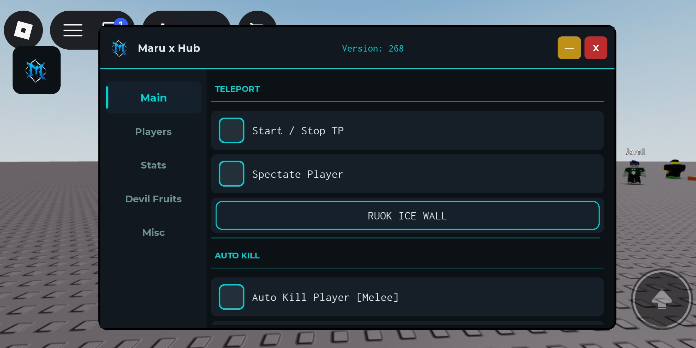

# MaruX Library V2.0

A lightweight and customizable Roblox GUI Library for PC & Mobile.

## Preview



---

## How to Use

### Load Library

```lua
local Library = loadstring(game:HttpGet("https://raw.githubusercontent.com/hfejjkebr-oss/main/refs/heads/main/MaruX_LibraryV2.0.lua"))()
```

### Set Theme

```lua
Library:SetTheme({
    Accent = Color3.fromRGB(0, 210, 210),
    Background = Color3.fromRGB(12, 17, 22),
})
```

### Create Window

```lua
local Window = Library:CreateWindow({
    Title = "Maru x Hub",
    Version = "Version: 268",
    Logo = "rbxassetid://125484418530410",
})
```

### Create Tab

```lua
local MainTab = Window:AddTab("Main")
```

---

# Components

## Section

```lua
MainTab:AddSection("Teleport")
```

## Toggle

```lua
MainTab:AddToggle({
    Name = "Start / Stop",
    Default = false,
    Callback = function(state)
        print("State:", state)
    end,
})
```

## Button

```lua
MainTab:AddButton({
    Name = "Test Button",
    Callback = function()
        print("Button clicked!")
    end,
})
```

## Slider

```lua
MainTab:AddSlider({
    Name = "Walk Speed",
    Min = 16,
    Max = 500,
    Default = 16,
    Callback = function(value)
        print("Value:", value)
    end,
})
```

## Dropdown

```lua
local dropdown = MainTab:AddDropdown({
    Name = "Select Player",
    Options = {
        "Player 1",
        "Player 2",
        "Player 3"
    },
    Default = "Player 1",
    Callback = function(value)
        print("Selected:", value)
    end,
})
```

## Refresh Dropdown

```lua
dropdown:Refresh({
    "Player 1",
    "Player 2",
    "Player 3"
})
```

## Get Dropdown Value

```lua
local selected = dropdown:Get()
print(selected)
```

## Keybind

```lua
MainTab:AddKeybind({
    Name = "Aimbot Key",
    Default = Enum.KeyCode.Q,
    Callback = function()
        print("Key pressed!")
    end,
})
```

## Color Picker

```lua
MainTab:AddColorPicker({
    Name = "ESP Color",
    Default = Color3.fromRGB(0, 210, 210),
    Callback = function(color)
        print("Color:", color)
    end,
})
```

## Textbox

```lua
MainTab:AddTextbox({
    Name = "Server Note",
    Placeholder = "Enter text...",
    Default = "",
    ClearOnFocus = true,
    Callback = function(text)
        print("Text:", text)
    end,
})
```

## Label

```lua
MainTab:AddLabel(
    "MaruX Library V2.0",
    Color3.fromRGB(0, 210, 210)
)
```

## Separator

```lua
MainTab:AddSeparator()
```

## Notification

```lua
Library:Notify({
    Title = "MaruX",
    Message = "Library loaded!",
    Type = "success",
    Duration = 4,
})
```

## Mobile Toggle

```lua
Library:AddMobileToggle(
    Window,
    "rbxassetid://125484418530410"
)
```

---

# Complete Example

```lua
local Library = loadstring(game:HttpGet("https://raw.githubusercontent.com/hfejjkebr-oss/main/refs/heads/main/MaruX_LibraryV2.0.lua"))()

Library:SetTheme({
    Accent = Color3.fromRGB(0, 210, 210),
    Background = Color3.fromRGB(12, 17, 22),
})

local Window = Library:CreateWindow({
    Title = "Maru x Hub",
    Version = "Version: 268",
    Logo = "rbxassetid://125484418530410",
})

local MainTab = Window:AddTab("Main")

MainTab:AddSection("Teleport")

MainTab:AddToggle({
    Name = "Start / Stop TP",
    Default = false,
    Callback = function(state)
        print("TP:", state)
    end,
})

MainTab:AddToggle({
    Name = "Spectate Player",
    Default = false,
    Callback = function(state)
        print("Spectate:", state)
    end,
})

MainTab:AddButton({
    Name = "RUOK ICE WALL",
    Callback = function()
        Library:Notify({
            Title = "Ice Wall",
            Message = "RUOK ICE WALL กำลังทำงาน!",
            Type = "success",
            Duration = 3,
        })
    end,
})

MainTab:AddSeparator()
MainTab:AddSection("Auto Kill")

MainTab:AddToggle({
    Name = "Auto Kill Player [Melee]",
    Default = false,
    Callback = function(state)
        print("Auto Melee:", state)
    end,
})

MainTab:AddToggle({
    Name = "Auto Kill Player [Gun]",
    Default = false,
    Callback = function(state)
        print("Auto Gun:", state)
    end,
})

local PlayerTab = Window:AddTab("Players")

PlayerTab:AddSection("Target")

local playerDrop = PlayerTab:AddDropdown({
    Name = "Select Player",
    Default = nil,
    Options = (function()
        local list = {}

        for _, p in pairs(game.Players:GetPlayers()) do
            table.insert(list, p.Name)
        end

        return list
    end)(),

    Callback = function(value)
        print("Selected:", value)
    end,
})

local function UpdatePlayers()
    local list = {}

    for _, p in pairs(game.Players:GetPlayers()) do
        table.insert(list, p.Name)
    end

    playerDrop:Refresh(list)
end

game.Players.PlayerAdded:Connect(UpdatePlayers)
game.Players.PlayerRemoving:Connect(UpdatePlayers)

PlayerTab:AddSeparator()
PlayerTab:AddSection("Aimbot")

PlayerTab:AddToggle({
    Name = "Aimbot Gun",
    Default = false,
    Callback = function(state)
        print("Aimbot:", state)
    end,
})

PlayerTab:AddSlider({
    Name = "FOV",
    Min = 10,
    Max = 360,
    Default = 90,
    Suffix = "°",
    Callback = function(value)
        print("FOV:", value)
    end,
})

PlayerTab:AddSlider({
    Name = "Prediction",
    Min = 0,
    Max = 100,
    Default = 20,
    Suffix = "%",
    Callback = function(value)
        print("Prediction:", value)
    end,
})

PlayerTab:AddKeybind({
    Name = "Aimbot Key",
    Default = Enum.KeyCode.Q,
    Callback = function()
        print("Aimbot key pressed!")
    end,
})

local StatsTab = Window:AddTab("Stats")

StatsTab:AddSection("Speed & Jump")

StatsTab:AddSlider({
    Name = "Walk Speed",
    Min = 16,
    Max = 500,
    Default = 16,
    Callback = function(value)
        local character = game.Players.LocalPlayer.Character

        if character and character:FindFirstChild("Humanoid") then
            character.Humanoid.WalkSpeed = value
        end
    end,
})

StatsTab:AddSlider({
    Name = "Jump Power",
    Min = 50,
    Max = 500,
    Default = 50,
    Callback = function(value)
        local character = game.Players.LocalPlayer.Character

        if character and character:FindFirstChild("Humanoid") then
            character.Humanoid.JumpPower = value
        end
    end,
})

StatsTab:AddButton({
    Name = "Reset Stats",
    Callback = function()
        local character = game.Players.LocalPlayer.Character

        if character and character:FindFirstChild("Humanoid") then
            character.Humanoid.WalkSpeed = 16
            character.Humanoid.JumpPower = 50
        end

        Library:Notify({
            Title = "Stats Reset",
            Message = "Settings have been reset.",
            Type = "warning",
        })
    end,
})

local FruitTab = Window:AddTab("Devil Fruits")

FruitTab:AddSection("Auto Farm Fruits")

FruitTab:AddToggle({
    Name = "Auto Collect Fruit",
    Default = false,
    Callback = function(state)
        print("Auto Collect:", state)
    end,
})

local fruitDrop = FruitTab:AddDropdown({
    Name = "Target Fruit",
    Options = {
        "Gomu",
        "Mera",
        "Hie",
        "Gura",
        "Ope",
        "Magu"
    },
    Default = "Gomu",
    Callback = function(value)
        print("Target Fruit:", value)
    end,
})

FruitTab:AddButton({
    Name = "Teleport to Fruit",
    Callback = function()
        local selected = fruitDrop:Get()

        Library:Notify({
            Title = "Fruit Finder",
            Message = "Searching " .. selected .. "...",
            Type = "info",
        })
    end,
})

local MiscTab = Window:AddTab("Misc")

MiscTab:AddSection("Visual")

MiscTab:AddToggle({
    Name = "ESP Players",
    Default = false,
    Callback = function(state)
        print("ESP:", state)
    end,
})

MiscTab:AddToggle({
    Name = "Noclip",
    Default = false,
    Callback = function(state)
        print("Noclip:", state)
    end,
})

MiscTab:AddColorPicker({
    Name = "ESP Color",
    Default = Color3.fromRGB(0, 200, 200),
    Callback = function(color)
        print("Color:", color)
    end,
})

MiscTab:AddSeparator()
MiscTab:AddSection("Info")

MiscTab:AddTextbox({
    Name = "Server Note",
    Placeholder = "Enter text...",
    Default = "",
    ClearOnFocus = true,
    Callback = function(text)
        print("Note:", text)
    end,
})

MiscTab:AddLabel(
    "MaruX Hub v2.0 — by MaruX",
    Color3.fromRGB(0, 200, 200)
)

MiscTab:AddLabel(
    "สคริปต์นี้ใช้งานเพื่อทดสอบเท่านั้น"
)

Library:AddMobileToggle(
    Window,
    "rbxassetid://125484418530410"
)

task.delay(0.5, function()
    Library:Notify({
        Title = "MaruX Hub Loaded!",
        Message = "Load",
        Type = "success",
        Duration = 4,
    })
end)
```

---

# Features

- PC Support
- Mobile Support
- Draggable Window
- Mobile Toggle Button
- Custom Theme
- Tabs
- Sections
- Toggle
- Button
- Slider
- Dropdown
- Keybind
- Color Picker
- Textbox
- Label
- Separator
- Notifications
- Dropdown Refresh
- Dropdown Get Value

---

# Files

[Example.lua](./Example.lua)

[MaruX_LibraryV2.0.lua](./MaruX_LibraryV2.0.lua)

---

# Library URL

https://raw.githubusercontent.com/hfejjkebr-oss/main/refs/heads/main/MaruX_LibraryV2.0.lua

---

# Credits

**MaruX Hub**

**MaruX Library V2.0**

Made for Roblox GUI development and testing.
